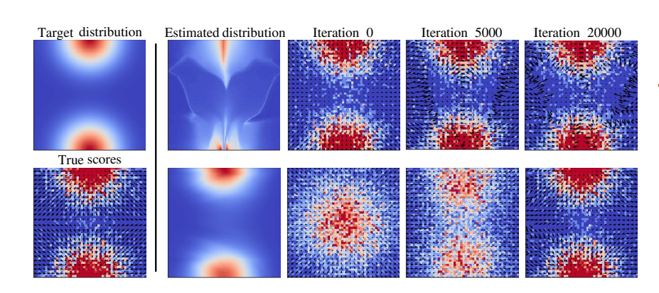

# Data Mollification for Likelihood-based Generative Models
Code for the paper "One-Line-of-Code Data Mollification Improves Optimization of Likelihood-based Generative Models" (NeurIPS 2023)

## Abstract

Generative Models (GMs) have attracted considerable attention due to their tremendous success in various domains, such as computer vision where they are capable to generate impressive realistic-looking images. Likelihood-based GMs are attractive due to the possibility to generate new data by a single model evaluation. However, they typically achieve lower sample quality compared to state-of-the-art score-based Diffusion Models (DMs). This paper provides a significant step in the direction of addressing this limitation. The idea is to borrow one of the strengths of score-based DMs, which is the ability to perform accurate density estimation in low-density regions and to address manifold overfitting by means of data mollification. We propose a view of data mollification within likelihood-based GMs as a continuation method, whereby the optimization objective smoothly transitions from simple-to-optimize to the original target. Crucially, data mollification can be implemented by adding one line of code in the optimization loop, and we demonstrate that this provides a boost in generation quality of likelihood-based GMs, without computational overheads. We report results on real-world image data sets and UCI benchmarks with popular likelihood-based GMs, including variants of variational autoencoders and normalizing flows, showing large improvements in FID score and density estimation.




## One-line-of-code Data Mollification!

A **very simple additional step** to mollify the data in any training loop to improve the training of likelihood-based generative models.

```python
noise = sigmoid_schedule(current_iter, N_max=num_mollification_iters)
data = np.sqrt(1-noise) * data + np.sqrt(noise) * torch.randn_like(data)
```

Here, we use a sigmoid schedule for the noise which is defined as follows:

```python
def sigmoid(x):
    return 1 / (1 + np.exp(-x))

def sigmoid_schedule(t, start=0, end=3, tau=0.7, clip_min=1e-9, N_max=1):
    t = t / N_max
    v_start = sigmoid(start / tau)
    v_end = sigmoid(end / tau)
    output = sigmoid((t * (end - start) + start) / tau)
    output = (v_end - output) / (v_end - v_start)
    return np.clip(output, clip_min, 1.)
```

## Examples

In this repository, we provide some examples of using our method for the tasks of density estimation and image generation. To run these examples, please execute the following command to setup the required anaconda environment for the repository:


```bash
conda env create -f environment.yaml
conda activate mollification
```

## Contact
Feel free to contact me via email ([ba-hien.tran@eurecom.fr](ba-hien.tran@eurecom.fr)) if you have any issues or questions.

## Citation
When using this repository in your work, please consider citing our paper

```
@inproceedings{Tran2023Mollification,
  author    = {Tran, Ba-Hien and Franzese, Giulio and Michiardi, Pietro and Filippone, Maurizio},
  title     = {{One-Line-of-Code Data Mollification Improves Optimization of Likelihood-based Generative Models}},
  booktitle = {Advances in Neural Information Processing Systems},
  address   = {New Orleans, USA},
  publisher = {Curran Associates, Inc.},
  volume    = {37},
  year      = {2023}
}
```
